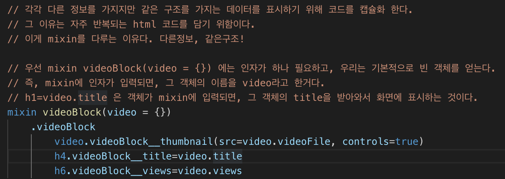

# WeTube

Cloning Youtube with Vanilla and NodeJS

## WETUBE 를 만들면서 배운 이론과 기능들 정리.

### Node.js란 무엇인가?

브라우저에 종속 되어 있고 브라우저에 맞춰진 언어였던,  Javascript를 브라우저 밖으로 가지고 나와서 유저가 사용 할 수 있게 한 것이다.

이것을 통해서 우리는 file system을 다룰수 있다. 

서버를 만들수있고, Web scrapper를 만들어서 웹페이지에 접속해서 정보들을 수집 할 수 있다.

위에 일이 가능한 이유는 Javascript가 프로그래밍 언어 이기 때문이다. 

Node.js를 쓰는 이유는 무엇일까?

	1. 프론트와 백엔드 모두를 Javascript로 만들때 
	2. 특정 라이브러리 없이 처음 부터 하나 하나 쌓아가는 식으로 작업을 수행한다. (호불호가 갈리지만 정확히 내가 무엇을 하고 있는지 인식 할 수 있다.)
	3. 내가 많은 데이터를 움직여야 할 때 사용하기 정말 좋다. 즉, 많은 데이터를 다뤄야 할때 ex) database 생성, database 삭제, 사용자에게 전송하고, 어떤 곳에 저장하고 등등 node.js는 데이터를 다루는 성능이 아주 좋다.

* macOS에서 사용하는 홈브루(Homebrew)는 자유 오픈소스 소프트웨어 패키지 관리 시스템의 하나이며, macOS 운영체제의 소프트웨어 설치를 단순하게 만들어 준다.

### ExpressJS 서버

#### What is a Server?

서버는 우리가 사용하는 인터넷이 연결 된 모든 컴퓨터를 말한다. 

물리적인 서버와 소프트웨어 적인 서버로 구분하며 온종일 온라인에 접속 된 상태이다.

서버 하나당 엄청 많은 하드 드라이브와 메모리, 보드들로 구성되어 있다.

1. 물리적인 서버의 모습 
	
    

2. 소프트웨어 적인 서버의 모습
    
    간단히 말하면 인터넷에 연결된 한 덩어리의 코드를 의미한다.
    
    일종의 네트워크에 연결 된 것이며, public 네트워크와 private 네트워크 두가지 모두 이며, URL에 응답하고, 접속을 허락하는 일을 한다.
    
    예를들어 네이버 사이트도 어딘가에서 Hosting 되고 있을 것이며, 그 말은 어딘가 서버가 있다는 것이다.

#### Installing Express with NPM

우리는 Express를 설치하기 전에 Node pachage Manager를 알아야한다. 

줄임말로 NPM이라고 하며, 이것은 Express, react, electron 등등의 오브젝트들을 NPM을 통해 다운로드하고 업로드하고 업데이트하며, 관리가 가능하도록 한다. 

하나의 공장에 node.js와 관련된 오브젝트들이 모여 있고 그곳에서 작업들이 이뤄진다. 

이렇게 사용하는 이유는 Express, react, electron 들이 따로 있는것 보다 관리하기 쉽고, 만약 내 프로젝트가 오픈소스라면 다른 사용자가 처음 부터 설치 및 셋팅을 하지 않아도 간단하게 NPM을 통해서 내가 작업 했던 환경을 빠르게 셋팅하고 이용하고 작업 할 수 있기 때문이다.

그럼 NPM의 설치 하는 법은 무엇일까? 사실 우리는 Node.js를 설치할때 같이 설치 되었다고 보면 된다.

설치 된 NPM을 이용해서 프로젝트를 시작해야 한다. (이유는 위에 작성한 것 처럼 다양한 사람과 공유를 하고 좀 더 쉽고 빠르게 설치 및 관리 하기 위해서)

1. npm init

	이 명령어를 통해서 우리는 첫 시작을 하며, 프로젝트 명, 버전, 어떠한 프로젝트 인지 묘사, 이 프로젝트의 주인 등등 작성을 한다.
    
    작성이 끝나면 pachage.json이라는 파일이 생성 되고, 그 안에 우리가 작성 했던 사항들이 Javascrip에서 정보를 담는 방식으로 작성되어 있는것을 확인 할 수 있다.)

    

    

   
2. 두번째로 npm install express 
    
    설치를 마치게 되면, 두 가지가 생성 되는데 그중에서 node_modules 폴더가 중요하다.
    
    설치 완료 이후 우리의 package.json에는 "dependencles" : {"express":"해당 버전명"} 이 작성 되어 있는 것을 확인 할 수 있다.
    
#### Your First Express Server 및 .gitignore에 대해서

해당 서버의 첫 걸음은

    const express = require('express'); 를 통해서 node_modales 폴더에 있는 Express를 import하고 
    const app = express(); 를 통해서 사용하면 된다. app로 사용 가능
      
    const PORT = 4000; ---> 좀 더 깔끔하게 보이기 위한 코딩 밑에 ${PORT}를 위해 사용

	function handleListening() {
  		console.log(`Listening on: http://localhost:${PORT}`);
	}
    콜백함수를 사용하는 것. 

	app.listen(PORT, handleListening); app에게 (app는 express와 같다) 4000번 포트를 listen 하게 해주고, 
    listening 하기 시작할때, handleListening 이라는 함수를 호출 해준다.
    
 이러면 localhost:40000 으로 가게 되면 서버가 실행 된 것을 알 수 있다. 그전에 서버 가동 해줘야함. 
 나는 package.json에 
 
 	"scripts": {
    "start": "node index.js"
    }
    
설정을 해주었기에 npm start만 해주면 서버가 가동 된다.

* .gitignore이란?
	
    git 저장소에 저장 될때 무시목록을 작성해서 관리 할 수 있는 것이다. 가령 중요한 키값이 저장소에 올라가지 않게 할 수 있다.

    

     위 이미지는 첫 프로젝트를 만들고 git 저장소를 만들때의 방식이다.

 #### Handling Routes with Express
 
 우리는 HTTP 메소드 중에 get과 post를 이용해서 서버와 라우터 핸들링을 할 것이다. 
 
 * GET Method
     
     GET 요청을 캐시할 수 있고, 브라우저 기록에 남아 있고, 예약 할 수 있으며, 중요한 데이터를 처리할 때 GET 요청을 사용해서는 안된다. 그리고 길이 제한이 있고, 마지막으로 데이터 요청에만 사용된다.
     
     예를들어 게시판의 리스트를 본다거나, 글을 본다거나, 검색을 한다거나 등등.
     
     GET은 가져오는 것(read) 정보조회.
   
 * POST Method

    GET과는 다르게 캐시되지 않고, 브라우저 기록에 남아 있지 않고, 예약 할 수 없고, 데이터 길이 제한이 없다.
    
    예를들어 게시판 작성 또는 회원가입 등등.
    
    POST는 수행하는 것(create) 새로운 정보등록.
    

허나 이 이미지 속 작업방식과 다르게 실제로는 완전한 html,css 파일을 send 해줘야하며, 앞으로 우리가 배울 것이다.

즉, 서버를 생성 -> route를 생성 -> 응답(res) 하는 방식.

#### ES6 on NodeJS Using Babel

##### Babel

Babel은 최신의 Javascript 코드를 아주 무난한 예전의 Javascript 코드로 변환해 준다.

babel은 여러가지 방법으로 사용 가능하며, 우리가 사용 할 방법은 babel node다.

이 변환을 써주기 위해서 3가지 설치를 해준다.

	1. npm install @babel/node
	2. npm install @babel/core
	3. npm install @babel/preset-env

그 이후 우리는 .babelrc 파일을 만들어주고 이 파일에 우리가 원하는 node.js와 js를 필요에 의해서 넣을 것이다.

즉, babel 넌 이런 preset을 가질 것이라 설정 해주는 것이다.

또한 기본 함수를 arrow function 방식으로 변환이 가능하게 된다.

##### 번외

우리는 수동으로 서버를 켜고 끄는건 별로 좋은 방법이 아니기에 nodemon 이라는 package를 설치 한다.

허나 이건 프로젝트를 위하기 보단 프로그래머를 위한 설정이기에 dependency에 포함 시키기 보단. 이 밖에 따로 설치 해주는게 좋다.

	npm install nodemon -D 
    해주면 package.json에 해당 nodemon이 설치가 된 것이 표시가 되게 된다. 
    
이 방법을 통해서 우리는 서버를 수동적으로 키고 끄는걸 안해도 되지만, 문제가 babel이 코드를 변환 하는 사이에 서버의 재시작이 더 빠르게 이뤄져서 정확히 코드를 못읽는 사태가 발생한다.

이 오류를 고치기 위해서 우리는 package.json에 

	"scripts":{"start":"nodemon --exec babel-node index.js --delay 2"}
    
    --delay 2 딜레이 2초를 해준다.
    
#### Express core: Middlewaes.

Express의 middleware란 웹사이트에 접속 이후 index.js파일을 실행하고 우리의 application이 route가 존재하는지 살펴보는데, 

그럼 우리가 작성한 코딩에서 

	app.get("/", handleHome); (/)home을 찾고, handleHome 함수를 실행 할 것이다.
    
그럼 handleHome은 응답을 해주는데, 바로 그전에 home과 함수 사이에 미들웨이가 존재하게 된다.

즉, 접속 이후 route 실행 이전에 미들웨이가 위치하게 되며, 그 미들웨어는 모든 함수들이 될 수 있다.

예를들자면 유저의 로그인을 체크하거나, 접속 되는 log들을 작성하는 미들웨어를 만들수도 있다. 

사용 방법은 밑에 이미지 처럼 사용되고, 저 위치에 미들웨어가 있다면 /home, /profile route 기능 이전에 미들웨어 먼저 동작하게 된다.

또한 우리는 추가적으로 middleware에 포함 된 다양한 기능들을 쓸 것인데, 그중에서도 밑에 이미지에 보이는 것 처럼 

1. morgan
2. helmet
3. body-parser
4. cookie-parser

를 사용 할 것이다.

#### Express Core: Routing

우리가 routing을 하기 전에 이해 해야할 것이 있다. 우선 프로젝트를 진행할때 다양한 방법으로 작업을 진행 하겠습니다.

대체적으로 또는 내가 이해하기론 동작들을 하나 하나 쪼개서 정리하는게 참 편리하고 좋다고 생각한다. 

지금 하는 작업들도 하나로 묶어서 코드를 작성해도 되지만, 작은 조각으로 쪼개 놓으면 수정 할때나 다양한 파일에서 모듈을 가져다 쓸때 더 기능적이고 편하다. 

예를들면 우리는 init.js를 만들기 전에 index.js 안에 두고 init.js 코드와 app 기능 등등 같이 묶어서 쓰고 있었다. 

이렇게 쓰면 한 곳에 너무 많은 코드가 길게 늘어져 있을 뿐 아니라 가독성이 너무 떨어진다. 

그래서 이미지에 보이는거 처럼 init.js를 만들어서 나두고, index.js는 app.js로 바꿔서 관련 app만 관리하게 둔다. 

또한 이렇게 관리하기 위해서 app.js에서 ES6 기능인 모듈을 이용해 init.js import 해준다. 

app.js에서 export default app; 이후 init.js에서 import app from "./app";  해준다는 것이다.

이 내용을 정리하자면 이 밑에 이미지와 같다.

다시 한번 간단히 설명하자면, 가독성 및 편의성을 위해서 프로젝트의 코드를 쪼개는게 좋은데, 이번 챕터에서 init.js를 만들고

index.js를 app.js로 바꿔준 이후 app.js에서 ES6 기능인 모듈을 이용해서 다른 파일의 object를 이용 할 수 있는데, 우리는 app.js object를 사용 할 것이다. 

그러므로 app.js에 export default app;(ES6 모듈 기능을 이용 하기 위한 코딩) 해주고, init.js에서 import해준다. 

또한 이제는 router.js를 만들어서 route들의 복잡함을 쪼개 줄 것이고 이것은 주소창을 세분화 하고 해당 주소에 작성되고 동작하게 코딩한 것들을 웹사이트에 띄어주는 역활을 한다. 

가령 /user 주소창으로 이동 했을때 나오는 유저 관련 정보가 웹사이트에 보여지면, /user/edit 으로 이동해서 유저 정보 관련을 수정 할 수도 있다. 

즉, 주소창 이름을 좀 더 직관적으로 만들고 그에 맞춰서 기능들도 한곳에 다 모아두는 것이 아니라 나눠서 세분화 시킨다고 보면 된다.

#### MVC Pattern

Model - 데이터를 의미한다. 즉, 데이터베이스

View - 데이터가 어떡게 생겼는지 (template)

Control - 데이터를 보여주는 또는 찾는 함수를 의미한다.

이 MVC 패턴은 일종의 구조라고 이해하면 된다.

우선적으로 우리는 그전과 다르게 routes.js 파일을 만들고 그 안에 사용할 URL들을 보이는 이미지 처럼 작성한다.

물론 다 작성한 이후에는 쓰기 위해서 ES6 기능인 모듈을 이용해 다른 파일에서 이용 할 수 있게 해준다.

그리고 난 후 우리는 routers 폴더에 들어있는 Router들이 좀 더 세분화로 구분 되게 작성해주고, Controller 폴더에 각각의 Controller.js를 만들어서 함수를 작동 시켜준다. 

이미지들은 위 라우터 부터 컨트롤러 순서에 맞게 보여지는 것이다.

그럼 이렇게 세세하게 나눠주는 건 왜 그런걸 걸까?

좀 더 구조적으로 그리고 세분화 해서 유지 보수에 용이하게 할 뿐만 아니라, 어떠한 문제가 생겼을때 다양하게 손봐야하는 어려움을 최대한 줄 일 수 있다. 

#### 요약

우리는 init.js 에는 app.js에서 import 한 application이 있고, application 관련 코드들은 app.js 파일에 담겨 있다.

그리고 express를 import 했고, express를 실행한 결과를 app 상수로 만들었다. 

또한 middleware들을 추가해줬음.

app.js에서 cookieParser는 cookie를 전달받아서 사용할 수 있도록 만들어주는 미들웨어고, 사용자 인증 같은 곳에서 쿠키를 검사 할 때 사용해준다.

app.js에서 bodyParser는 사용자가 웹사이트로 전달하는 정보들을 검사하는 미들웨어다. requsest 정보에서 form이나 json 형태로 된 body를 검사한다.

즉, 아바타의 사진이나 비디오를 업로드 할 때, 제목이나 댓글 같은 정보를 전달할때 form에 담아서 업로드 해야 한다.

app.js에서 helmet 미들웨어는 application이 더 안전하도록 만들어준다.

app.js에서 morgan 미들웨어의 역활은 application에서 발생하는 모든 일들을 logging 하는 것.

그리고 app.js에서 3가지의 router를 사용하고 그 중 globalRouter 안에는 /home, /search, /join, /login, /logout URL이 담겨 있고, 

userRouter and videoRouter 두가지도 각각의 관련 된 URL 주소들을 지니고 있다.

이 주소들은 routes.js에 정의해 뒀으며, 한 파일이 바뀌면 모두 적용되도록 할 수 있게 만들었다.

마지막으로 모든 router의 로직들은 모두 userController나 videoController에 정의되어 있다. 

즉, 모두 함수들이고 이곳에서 HTML, CSS 들을 리턴해 줄 수 있다.

이곳이 우리가 분류한 MVC 패턴에서 C에 해당하는 Control 부분이다.

#### Pug 대하여

pug는 view engine이며, template언어 이고, html 파일들을 더 보기 편하고 쉽게 이해하게 만들어준다.

pug, express에는 view 파일들의 위치에 관한 기본 설정이 존재 한다.

만약 그 설정을 바꾸고 싶다면 expressjs의 공식문서에 나온 것 처럼 view 설정들을 바꾸면 된다.

그렇다면 이 template을 웹사이트에서 보여주려면 어떤 방식으로 작업 해야할까?

Controllers 폴더에 있는 컨트롤러 파일들 중에 res.send를 res.render를 사용해서 해결 할 수 있다.

그럼 이러한 함수가 view 폴더에서 파일명이 home이고, 확장자가 pug인 템플렛 파일을 찾은 후에 보여준다.

확장자 pug는 이전에 우리가 view engine에서 설정 해줬다.

pug가 html에 보다 좋고 편리한 이유는 반복되는 작업은 따로 만들어 놓고 전체의 html을 유지보수 할 수 있다는 것이다. 

지금 하는 코드에서 우리는 main.pug를 중심으로 하고, 거기에 header.pug 그리고 foorter.pug 두개를 따로 만들어서 반복적으로 쓰며 수정이 필요하다면 저 세 곳만 고쳐서 전체 html 페이지를 바꿔 줄 수 있다.

즉, 우리가 home 화면에 접근하게 된다면 기본적인 틀(전반적으로 화면 이동이 이뤄져도 반복적으로 보이는 것들)을 보이게 된다. 그럼 main.pug가 실행되고 그 안에 html 기본 틀 및 header.pug, foorter.pug가 있고, block content를 통해서 다른 pug의 내용이 적용 된다.

예를들어 첫 홈 화면에서 회원가입으로 이동 했다면 main.pug에 작성된

	main
    	block content
    
덕분에 join.pug의 화면이 보이게 된다. 

그럼 join.pug 화면에서는 우리가 꼭 반복적으로 설정해줬던 main.pug, header.pug, foorter.pug 파일들이 보이게 되고(여기에 작성한 코드들이 보인다는 말), join.pug에선 

	extends layouts/main
    
    block content  
         p Join
         
         
이걸 통해 main.pug에 block content 위치에 p태그 Join이 실행 되어있다.

위에 언급 했듯이 우리는 header.pug, foorter.pug도 따로 만들어서 main.pug에서 쓴다고 했는데, 쓰는 방법은 사용 하고 싶은 곳에 include로 시작해서 경로를 지정하면 된다.

	include ../partials/header 이러한 방식!
    
또한 pug 속에서 javascript를 사용하기 위해서는 #{} 이 안에 코드를 작성하면 된다. 예를들어

	span.footer__text #{siteName} #{new Date().getFullYear()} &copy; 
    이러한 방식!
    
그리고 우리는 컨트롤러에 있는 정보를 템플렛에 추가하는 법도 있는데 하나의 템플렛에만 추가하거나, 전체 템플렛에 추가 할 수 있다.

그중 먼저 전체적으로 템플렛에 추가하는 방법은 미들웨어를 이용하는 방법이 있다.

이런식으로 만든다. 

여기서 

	res.locals.siteName = "WeTube"; 는 footer.pug에서 #{siteName} 위치에 WeTube가 들어가게 된다.
    
이 이미지와 같이 코딩하면 된다.

또 우리는 위에 보이는 미들웨어에서 

	res.locals.routes = routes; 
    
이것도 코딩을 작업 했는데, 밑에 이미지 처럼 사용하게 된다.

보면 a(href=routes.join) Join 이러한 방식으로 사용 된걸 알 수 있다.

마지막으로 하나의 템플릿에만 변수를 추가 하려면 Controller.js에서 #{쓰고싶은이름적기}를 작성하고 템플렛에 적용 시켜주면 된다.

밑에 이미지와 같다.

res.render("home", { pageTitle: "Home" });

이곳에서 이뤄지는건데, 첫번재 "home" 인자는 템플렛이고, 두번째 인자 { pageTitle: "Home" }는 템플렛에 추가할 정보가 담긴 것이다.

고로 템플렛에 작성해서 사용하는 법은 밑에 이미지 처럼 사용하면 된다.

#### Search Controller(검색한 단어나 명칭이 홈페이지 화면 안에서 보여지게 만드는 법)

우리는 검색 기능을 통해서 주소창과 홈페이지에 내가 사용한 명칭이나 단어들을 확인 할 수 있다.

그 방법으로는

이러한 방법이 있다.

#### Join : Log in HTML

이번에는 소셜 가입 및 로그인을 만들어 보려고 한다. 우선 button이 필요한데 이 button은 여러 페이지에 적용 시키고 보수가 필요하면 그 페이지만 수정하면 될 수 있게 socialLogin.pug에 만들어 둔다.

이렇게 된다.

#### 데이터베이스를 이용해서 템플릿에 사용하는 법

우선 아직은 가짜 데이터베이스를 이용해서 만들었다. 하지만 실제 데이터를 이용하는 법도 같다.

이렇게 사용이 가능하다.

#### mixin을 이용해서 다른정보, 같은구조를 지닌 html 만드는법

mixin는 웹사이트에서 자주 반복되는 html 코드를 담고 있다.

기억하자.

#### 동영상 검색, join 이후 로그인 후 home 이동하는 법

우선 우리가 검색을 통해 영상을 검색하면 해당 영상만 들어내게 하는 법은

videoController.js 에 res.render("search", { pageTitle: "Search", searchingBy, videos }); 

이 코드 끝에 videos를 추가 해줌으로 써 mixin을 이용해서 Search.pug에서도 사용을 하는걸 알 수 있다.

즉, 검색을 했을때 해당 데이터베이스로 가서 검색한 명칭과 같은게 있다면 찾아내서 페이지에 보이게 해주는 것이다.

또 우리는 회원가입 시 정보를 입력하는데 join을 누르면 /join 경로로 post 하기 위한 설정이나 코드가 없기에 join되지 않는데, 이것을 해결 하기 위해서 

1. Route.js에 postjoin 이동경로를 만들어 준다.
2. Controller.js에 postjoin 함수를 만들어 준다.

즉, 우리는 globalRouter.js에 postjoin 경로를 만들고 그걸 통해 Controller.js로 이동해서 postjoin 함수가 동작하게 된다.

라우터에 코드는 globalRouter.post(routes.join, postJoin) 이 될 것이고, 

컨트롤에서는 

	export const postJoin = (req, res) => {
        const {
            body: { name, email, password, password2 }
        } = req;
        if(password !== password2) {
          res.status(400);
          res.render("join", { pageTitle: "Join" });
        } else {
        res.redirect(routes.home);
        
       }
     };
     
이런 코드가 작성 될 것이다.

풀어보면 body에 이런 요청을 통해서 form 형태로 받아지고 그 받은 정보 중 패스워드 두개를 비교해서 틀리면 400 상태코드 발동 해서 잘못 된 요청을 표기해준다. 

틀리리 않았으면 home 페이지를 로그인 후에 가준다.

여기서 app.js에 bodyParser 미들웨어가 존재 하지 않는다면, 내가 입력한 정보가 form 형태로 받아지지 않게 된다. 

그러니 꼭 기억해 두자.

#### 로그인 이후 유저 모드로 페이지 보이게 하기

 
 
 
 
 

 다만 우리는 여기서 위에 join 처럼 get, post를 나눈다는걸 기억 해야한다.

 ### MongoDB
 
 우리는 이제 가짜 db.js 대신에 진짜인 데이터베이스 MongoDB를 사용할 것이다.

MongoDB는 NoSQL로 분류되는 데이터베이스 이다.

데이터베이스는 다양하게 존재하지만, 큰 종류로 분류하면 SQL 또는 NoSQL 두가지로 나뉜다.

왜 우리는 MongoDB를 사용할까? 

더 적은 규칙과 더 적은 절차로 작업이 가능한 데이터베이스고, 많은 부분을 수정 할 수 있다.

그리고 많은 Relationship이 필요없는 일반적인 프로젝트를 진행할때 좋은 선택이다.

MongoDB 설치 관련해서 자료 찾는중... brew를 이용한 설치와 수동으로 하는법이 있는데 다 안돼고 있음....

#### dotenv 설치와 왜 사용 해야하는지에 대해서

실제 Application으로 만들었을 때, 보안적인 측면을 고려해서 숨겨야 할 코드 및 파일이 존재하는데 그때 사용 된다.

mongodb 설치 이후에 설치 한다는걸 잊지말자.

#### MongoDB Video Model(document name And Schema)

models폴더 안에 Video.js 코드

init.js 코드

#### ref를 통해서 Video와 Comment를 연결하는법.

이번에 하는 작업은 Video를 업로드 하고 난 이후 Comment를 달 수 있게 해주는 코드 작업이다.

둘의 관계를 지어줘야하는데 방법으로는

이러한 방법이 존재한다. 

명심해야 할 것은 하나의 ref고, Comment와 다르게 좋아요나 유저를 저장하거나 할때 다른 ref를 사용 할 것이다.